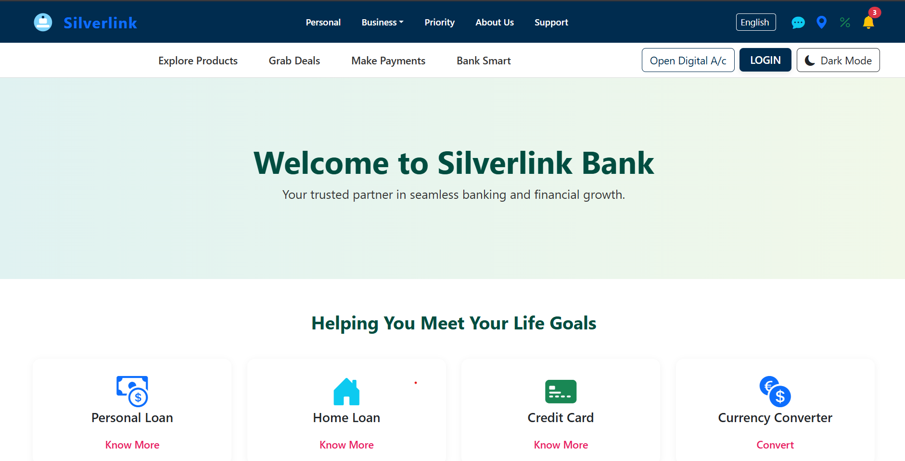

# 💳 Silverlink Banking System

Welcome to the **Silverlink Banking App** — a full-stack banking system designed to simulate real-world banking operations with a secure and responsive interface. This project provides core banking functionalities such as user authentication, account management, transaction handling, and a credit card module.

> 🚀 Built using **Java Spring Boot** on the backend and styled with **HTML/CSS/Bootstrap** on the frontend. MySQL powers the database.

---

## 🛠️ Technologies Used

### Backend
- Java 17+
- Spring Boot
- Spring MVC
- Spring Security (JWT-based Authentication)
- Spring Data JPA
- MySQL
- Lombok
- Maven

### Frontend
- HTML5, CSS3
- Bootstrap 5
- Thymeleaf (optional depending on your stack)

### DevOps / Tools
- IntelliJ IDEA / VS Code
- Postman (for testing APIs)
- Git & GitHub

---

## 🚧 Project Status

**✅ Completed Features:**
- User Registration & Login
- Secure JWT Authentication
- User Dashboard with account details
- Admin Panel
- Credit Card Management Module
- Transaction Tracking
- PostgreSQL Database Integration
- Basic UI styling for homepage and dashboard

**🛠️ In Progress / To-Do:**
- 🏦 Loan module (apply/approve)
- 📄 Bank statement generation (PDF/Excel)
- 📊 Data visualization (account analytics)
- 📲 Mobile responsiveness
- 🧪 Unit and Integration Testing

---
